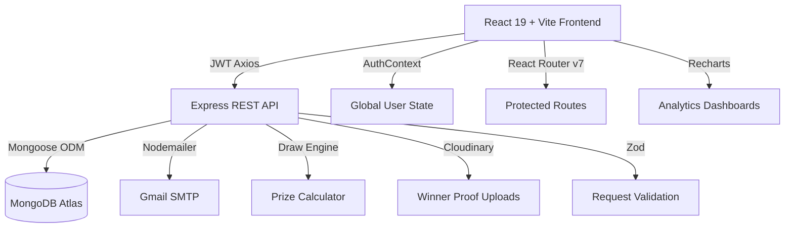

<div align="center">

# ⛳ Golf Charity Platform

### Premium Golf Draw & Charity Fundraising Management System

[](https://developer.mozilla.org/en-US/docs/Web/JavaScript)
[](https://reactjs.org/)
[](https://nodejs.org/)
[](https://www.mongodb.com/)
[](https://expressjs.com/)
[](https://vitejs.dev/)

**A full-stack, subscription-based golf draw platform where subscribers log Stableford scores, compete in monthly jackpot draws, and automatically donate a percentage of their subscription fee to real-world charities.**

</div>

---

## 🔗 Project Links

<table>
<tr>
<td align="center" width="25%">

### 🌐 **Frontend**
[](#)

[View Live Site →](https://golf-charity-frontend-eta.vercel.app)

</td>
<td align="center" width="25%">

### ⚙️ **Backend**
[](#)

[API Server →](https://golf-charity-assigmenent.onrender.com/)

</td>
<td align="center" width="25%">

### 📖 **API Docs**
[](#)

[Documentation →](#)

</td>
<td align="center" width="25%">

### ▶️ **Demo Video**
[](#)

[Watch on YouTube →](#)

</td>
</tr>
</table>

---

## 🎯 What Is This?

The **Golf Charity Platform** is a premium SaaS application built for golf clubs and charity fundraising events. Subscribers pay a monthly or yearly fee, enter their golf scores, and every month the platform runs a fully automated draw engine. Winners are determined by how closely their scores match the randomly generated numbers. Meanwhile, a configurable percentage of every subscription is automatically routed to a chosen charity.

The platform features a stunning dark-mode, glassmorphic "Bento Box" UI, admin analytics dashboards with live Recharts graphs, professional HTML email notifications, a simulated payment flow (Stripe-ready), and a complete admin control suite.

---

## 🔑 Core Concepts

| Concept | How It Works |
|---|---|
| **Subscriptions** | Users subscribe Monthly (£9.99) or Yearly (£89.99) to participate |
| **Score Logging** | Subscribers log up to 5 Stableford scores (1–45) per month |
| **Monthly Draw** | Admin runs the engine; 5 random numbers are generated & matched against scores |
| **Prize Tiers** | 3 matches = Tier 3, 4 matches = Tier 4, 5 matches = Jackpot |
| **Charity Impact** | 10–100% of each subscription fee goes to the subscriber's chosen charity |
| **Jackpot Carry** | If no 5-match winner, the jackpot carries forward to next month |

---

## 🚀 Key Features

<table>
<tr>
<td width="50%">

### 👤 **For Users (Subscribers)**

- 🔐 **Account Registration & Auth** — JWT-secured login with persistent sessions
- 💳 **Subscription Plans** — Monthly & Yearly with a realistic checkout flow
- 🎯 **Score Logging** — Log up to 5 Stableford scores (1–45) per draw cycle
- 🏆 **Winnings Dashboard** — Track prize wins, amounts, and payout status
- ❤️ **Charity Selection** — Choose and change your supported charity anytime
- ⏱️ **Live Countdown** — Real-time countdown timer to the next draw date
- 📊 **Overview Dashboard** — Bento grid with subscription status, scores, and wins

</td>
<td width="50%">

### 🛡️ **For Admins**

- 🎰 **Draw Engine Control** — Create drafts, simulate, and publish monthly draws
- ⚙️ **Manual Number Entry** — Type exact numbers or use random/algorithm generation
- 📈 **Analytics Dashboard** — Area charts, stacked bar charts, pie charts via Recharts
- 👥 **User Management** — Search users, update roles, subscription status, charity %
- 🏅 **Winner Verification** — Review, approve or reject winner claims with proof uploads
- 🏦 **Charity Management** — Create, edit, and track donation totals per charity
- 📋 **Subscription Overview** — Filter by status (active, expired, canceled, failed)

</td>
</tr>
</table>

### 🌟 **Platform-Wide Features**

- 🎨 **Premium Dark UI** — Glassmorphic "Bento Box" layout with animated gradients and glow effects
- 📧 **Professional HTML Emails** — Branded dark-mode email templates for all key events
- 💳 **Simulated Payment Gateway** — Realistic card checkout UI (Stripe-ready, no keys required for testing)
- 🔔 **Toast Notification System** — Smooth, styled toasts for all user actions
- 📱 **Responsive Layouts** — CSS Grid bento system adapts across all screen sizes
- 🌱 **Seed Script** — One-command database population with 20 users, 6 months of draw history, and 3 charities

---

## 🛠️ Tech Stack

### **Frontend**
<p>


</p>

### **Backend**
<p>


</p>

---

## 📁 Project Structure

```
mayur2/
├── 🔧 backend/
│   ├── scripts/
│   │   └── seed.js                  # Database seeder (users, charities, draws)
│   ├── src/
│   │   ├── 🎮 controllers/
│   │   │   ├── authController.js    # Register, Login, Me
│   │   │   ├── userController.js    # Profile, Admin analytics, User management
│   │   │   ├── subscriptionController.js  # Checkout, Webhook, Simulate, Cancel, Renew
│   │   │   ├── drawController.js    # Draft, Simulate, Publish, Run, History
│   │   │   ├── charityController.js # CRUD + Donate + Select
│   │   │   ├── scoreController.js   # Add, List, Admin update
│   │   │   └── winnerController.js  # List, Proof upload, Status update
│   │   ├── 📊 models/
│   │   │   ├── User.js
│   │   │   ├── Subscription.js
│   │   │   ├── Draw.js
│   │   │   ├── Score.js
│   │   │   ├── Winner.js
│   │   │   ├── Charity.js
│   │   │   └── Donation.js
│   │   ├── 🛣️ routes/
│   │   │   ├── authRoutes.js
│   │   │   ├── userRoutes.js
│   │   │   ├── subscriptionRoutes.js
│   │   │   ├── drawRoutes.js
│   │   │   ├── charityRoutes.js
│   │   │   ├── scoreRoutes.js
│   │   │   └── winnerRoutes.js
│   │   ├── 🔒 middlewares/
│   │   │   ├── authMiddleware.js    # JWT protect
│   │   │   └── adminMiddleware.js   # Role guard
│   │   ├── ⚙️ config/
│   │   │   ├── db.js
│   │   │   ├── env.js
│   │   │   └── stripe.js
│   │   ├── 🛠️ utils/
│   │   │   ├── emailService.js      # Nodemailer transporter
│   │   │   ├── emailTemplates.js    # Branded HTML email templates
│   │   │   ├── drawEngine.js        # Number generation (random/algorithm/manual)
│   │   │   ├── prizeCalculator.js   # Tiered prize pool calculator
│   │   │   ├── subscriptionStatus.js
│   │   │   └── AppError.js
│   │   ├── app.js
│   │   └── server.js
│   ├── .env
│   └── package.json
│
└── 💻 frontend/
    ├── src/
    │   ├── 🏪 context/
    │   │   └── AuthContext.jsx       # Global user state, loginUser, logoutUser, refreshUser
    │   ├── 🔌 api/
    │   │   └── api.js                # Axios instance + all API exports
    │   ├── 🧩 components/
    │   │   ├── Navbar.jsx
    │   │   ├── GlowButton.jsx
    │   │   ├── GlassCard.jsx
    │   │   └── Skeletons.jsx
    │   ├── 📄 pages/
    │   │   ├── Landing.jsx           # Dark bento-box homepage
    │   │   ├── Login.jsx
    │   │   ├── Register.jsx
    │   │   ├── CheckoutSimulation.jsx  # Mock payment gateway
    │   │   ├── SubscriptionSuccess.jsx
    │   │   ├── dashboard/
    │   │   │   ├── DashboardLayout.jsx
    │   │   │   ├── DashboardOverview.jsx  # Bento stats + countdown timer
    │   │   │   ├── Scores.jsx
    │   │   │   ├── Charity.jsx
    │   │   │   └── Winnings.jsx
    │   │   └── admin/
    │   │       ├── AdminLayout.jsx
    │   │       ├── AdminOverview.jsx      # Global control center
    │   │       ├── AdminDraw.jsx          # Draw engine management
    │   │       ├── AdminUsers.jsx
    │   │       ├── AdminCharities.jsx
    │   │       ├── AdminWinners.jsx
    │   │       └── AdminAnalytics.jsx     # Recharts dashboard
    │   ├── index.css                 # Global dark theme + bento grid system
    │   ├── App.jsx
    │   └── main.jsx
    └── package.json
```

---

## 🏗️ Architecture Overview



**Key design choices:**
- **RESTful API** with role-based route guards (`protect` + `adminOnly` middlewares)
- **Zod** for all request body schema validation on the backend
- **AuthContext** provides `user`, `loginUser`, `logoutUser`, `refreshUser` globally
- **Draw Engine** separates number generation logic from the controller entirely
- **Bento Grid System** — custom CSS utility classes (`bento-card`, `bento-col-x`) for reusable dark glassmorphic layouts

---

## 🚀 End-to-End Setup

### 📋 Prerequisites

-  **Node.js 18+**
-  **MongoDB** (local or Atlas)
-  **npm 8+**

---

### ⚙️ Backend Setup

**1. Install dependencies:**
```bash
cd backend
npm install
```

**2. Create your `.env` file** (see [Environment Variables](#-environment-variables) below)

**3. Seed the database** with demo data (20 users, 3 charities, 6 months of draws):
```bash
node scripts/seed.js
```

**4. Start the server:**
```bash
node src/server.js
```

**Expected output:**
```
MongoDB connected
Server running on port 5000
```

All API routes available at: `http://localhost:5000/api/*`

---

### 💻 Frontend Setup

**1. Install dependencies:**
```bash
cd frontend
npm install
```

**2. Start the dev server:**
```bash
npm run dev
```

**3. Open your browser:**
```
http://localhost:5173
```

---

## 🔧 Environment Variables

### `backend/.env`
```env
# Server
PORT=5000
NODE_ENV=development

# MongoDB
MONGO_URI=mongodb://localhost:27017/golf-charity

# JWT
JWT_SECRET=your_super_secret_jwt_key_here_min_32_chars
JWT_EXPIRES_IN=7d

# Frontend (for CORS & redirect URLs)
FRONTEND_URL=http://localhost:5173

# Email (Nodemailer / Gmail)
EMAIL_SERVICE=gmail
EMAIL_USER=your_email@gmail.com
EMAIL_PASS=your_app_password_here
EMAIL_FROM="Golf Platform <your_email@gmail.com>"

# Subscription Pricing (in £)
MONTHLY_PRICE=9.99
YEARLY_PRICE=89.99

# Stripe (optional, simulation mode is default)
STRIPE_SECRET_KEY=sk_test_...
STRIPE_WEBHOOK_SECRET=whsec_...
MONTHLY_PRICE_ID=price_...
YEARLY_PRICE_ID=price_...

# Cloudinary (winner proof uploads)
CLOUDINARY_CLOUD_NAME=your_cloud
CLOUDINARY_API_KEY=your_key
CLOUDINARY_API_SECRET=your_secret

# Seeder Config
SEED_ADMIN_EMAIL=admin@golfplatform.com
SEED_ADMIN_PASSWORD=Admin@123
SEED_ADMIN_NAME=Platform Admin
```

---

## 🎯 API Endpoints

### **Auth**
```
POST   /api/auth/register          # Register + receive JWT
POST   /api/auth/login             # Login + receive JWT
GET    /api/auth/me                # Get current authenticated user
```

### **User**
```
GET    /api/user/profile           # Get full user profile + dashboard data
GET    /api/user/analytics         # Admin: platform-wide analytics metrics
GET    /api/user/admin/users       # Admin: list/search all users
PATCH  /api/user/admin/users/:id   # Admin: update user role/status
```

### **Subscriptions**
```
POST   /api/subscriptions                   # Create checkout session (returns checkoutUrl)
GET    /api/subscriptions/me                # Get current user's subscriptions
POST   /api/subscriptions/cancel           # Cancel active subscription
POST   /api/subscriptions/renew            # Renew subscription
POST   /api/subscriptions/webhook          # Stripe webhook handler
POST   /api/subscriptions/simulate-webhook # Dev: manually activate a mock session
GET    /api/subscriptions/admin            # Admin: list all subscriptions (filter by status)
PATCH  /api/subscriptions/admin/:id        # Admin: manually update subscription
```

### **Draws**
```
POST   /api/draw/draft             # Admin: create draft draw
POST   /api/draw/:id/simulate      # Admin: simulate (preview) without publishing
POST   /api/draw/:id/publish       # Admin: publish draw + notify all subscribers
POST   /api/draw/run               # Admin: one-shot create + publish
GET    /api/draw/latest            # Get most recent published draw
GET    /api/draw/history           # Get all published draws
```

### **Scores**
```
GET    /api/scores                 # Get current user's scores
POST   /api/scores                 # Log a new score (active subscription required)
PATCH  /api/scores/admin/:id       # Admin: manually update a score
```

### **Charities**
```
GET    /api/charities              # List all charities
POST   /api/charities              # Admin: create charity
PATCH  /api/charities/:id          # Admin: update charity
DELETE /api/charities/:id          # Admin: delete charity
POST   /api/charities/select       # User: select a charity
POST   /api/charities/:id/donate   # Manual donation
```

### **Winners**
```
GET    /api/winners                # Get winners (user: own | admin: all)
POST   /api/winners/proof          # Upload winner proof document
PATCH  /api/winners/:id/status     # Admin: approve/reject winner
```

---

## 💳 Subscription & Payment Flow

```
User clicks Subscribe
        │
        ▼
POST /api/subscriptions  (choose plan: monthly | yearly)
        │
        ▼
Backend creates Subscription doc (status: "created")
Returns checkoutUrl → /checkout-simulation?session_id=cs_mock_xxx
        │
        ▼
User fills fake card form (any 16-digit card + expiry + CVC)
        │
        ▼
POST /api/subscriptions/simulate-webhook { sessionId }
        │
        ▼
Backend activates: Subscription status → "active"
User.subscriptionStatus → "active"
Charity.totalDonations += charityAmount
Sends branded HTML activation email
        │
        ▼
Frontend → /subscription/success (calls refreshUser())
        │
        ▼
User's full Dashboard unlocked ✅
```

> **💡 Stripe-Ready:** The `createCheckoutSession` controller simply needs the Stripe environment variables set to switch from simulation mode to real Stripe Checkout automatically.

---

## 🎰 Draw Engine Logic

The draw engine (`src/utils/drawEngine.js`) supports three modes:

| Mode | How It Works |
|---|---|
| `random` | 5 unique random numbers between 1–45 |
| `algorithm` | Weighted selection based on historical score frequency |
| `manual` | Admin enters exactly 5 unique numbers |

**Prize Tiers** (configured in `src/utils/prizeCalculator.js`):

| Matches | Tier | Prize Allocation |
|---|---|---|
| 5 | Jackpot | 40% of total pool |
| 4 | Tier 2 | 35% of total pool |
| 3 | Tier 3 | 25% of total pool |
| 0 winners | Carry Forward | Jackpot rolls to next month |

---

## 📊 Admin Analytics Dashboard

The analytics page (`AdminAnalytics.jsx`) uses **Recharts** with real backend data:

- 📈 **Area Chart** — 6-month financial trend (Total Pool vs. Expenses) from draw history
- 📊 **Stacked Bar Chart** — Subscriber count and jackpot carry-forward per draw
- 🍩 **Donut Chart** — Live prize pool breakdown (40% / 35% / 25%) from real `totalPrizePool`
- 📋 **KPI Cards** — Network users, draws executed, pending winner verifications

---

## 📧 Email Notifications

All emails use professional dark-mode branded HTML templates (`emailTemplates.js`):

| Trigger | Template |
|---|---|
| New user registration | "Account Provisioned Successfully" |
| Subscription activated (webhook/simulate) | "Subscription Activated" |
| Subscription renewed | "Subscription Renewed" |
| Draw published — winner | "WINNER IDENTIFIED: Action Required" with emerald CTA |
| Draw published — participant | "Official Draw Results Published" with dashboard link |

---

## 📜 Scripts

### Backend
```bash
node src/server.js        # Start the API server
node scripts/seed.js      # Populate DB (20 users, 3 charities, 6 monthly draws)
```

### Frontend
```bash
npm run dev               # Start Vite dev server (http://localhost:5173)
npm run build             # Production build
npm run preview           # Preview production build
```

---

## 🐛 Troubleshooting

<details>
<summary><b>❌ MongoDB Connection Error</b></summary>

- Make sure MongoDB is running locally: `mongod`
- Or check your `MONGO_URI` in `.env` points to the correct Atlas cluster
- Verify the user in the connection string has `readWrite` permissions

</details>

<details>
<summary><b>❌ JWT / 401 Unauthorized on all requests</b></summary>

- Clear `localStorage` (`token` + `user`) in your browser DevTools
- Log in again to get a fresh token
- Ensure `JWT_SECRET` in `.env` hasn't changed since the token was issued

</details>

<details>
<summary><b>❌ Subscription simulate-webhook returns 404</b></summary>

- The `session_id` in the URL must match an existing Subscription document
- This happens if the backend was restarted and no `/api/subscriptions` POST was made for this session
- Start a fresh subscription flow from the Scores page

</details>

<details>
<summary><b>❌ Draw runs but no winners generated</b></summary>

- Users must have **active subscriptions** AND **at least 5 logged scores** to be eligible
- Run `node scripts/seed.js` first to populate demo data
- Check `resolveDrawParticipants()` in `drawController.js` for eligibility gates

</details>

<details>
<summary><b>❌ Emails not sending</b></summary>

- Ensure `EMAIL_USER` and `EMAIL_PASS` are set in `.env`
- For Gmail, use an **App Password** (not your main password) — regular passwords are blocked by Google
- Check your Gmail settings: enable 2FA → Security → App Passwords

</details>

<details>
<summary><b>❌ Vite PostCSS @import error on startup</b></summary>

- Ensure `@import url(...)` fonts line comes **before** `@import "tailwindcss"` in `index.css`

</details>

---

## 🔒 Security

- ✅ **JWT Authentication** — All protected routes verify bearer tokens in `authMiddleware`
- ✅ **Password Hashing** — Bcrypt with 10 salt rounds
- ✅ **Role Guards** — `adminOnly` middleware blocks all admin endpoints from regular users
- ✅ **Zod Validation** — All request bodies are schema-validated before hitting database
- ✅ **CORS** — Configured origin restriction to `FRONTEND_URL`
- ✅ **File Upload Safety** — Multer with Cloudinary CDN for winner proof images
- ✅ **No plain-text passwords in DB** — Mongoose `pre('save')` hook auto-hashes

> ⚠️ **Production Checklist:** Use a strong 32+ char `JWT_SECRET`, enable HTTPS, configure real Stripe keys, and set `NODE_ENV=production`.

---

## 🗺️ Roadmap

### **Phase 1 (Completed)** ✅
- [x] JWT auth with role-based access (admin / user)
- [x] Subscription system (monthly / yearly)
- [x] Score logging with draw eligibility gates
- [x] Draw engine (random / algorithm / manual)
- [x] Tiered prize pool calculator with jackpot carry-forward
- [x] Winner verification workflow with proof uploads
- [x] Charity selection and automatic donation tracking
- [x] Premium dark-mode bento glassmorphic UI
- [x] Recharts analytics dashboard
- [x] Professional HTML email notification templates
- [x] Simulated payment gateway (Stripe-ready)

### **Phase 2 (Planned)** 🔄
- [ ] Real Stripe payment gateway activation
- [ ] Two-factor authentication (2FA)
- [ ] SMS notifications (Twilio)
- [ ] PDF prize certificate generation
- [ ] Leaderboard pages
- [ ] Draw result social sharing cards

### **Phase 3 (Future)** 📅
- [ ] Mobile app (React Native)
- [ ] Multi-club / multi-location support
- [ ] Self-serve draw scheduling (cron)
- [ ] Charity partner integrations (JustGiving API)
- [ ] AI-based number prediction insights

---

## 🤝 Contributing

1. 🍴 Fork the repository
2. 🌿 Create your feature branch: `git checkout -b feature/amazing-feature`
3. 💻 Commit your changes: `git commit -m 'Add amazing feature'`
4. 📤 Push to branch: `git push origin feature/amazing-feature`
5. 🔀 Open a Pull Request

---

## 📄 License

This project is licensed under the **MIT License** — see the [LICENSE](LICENSE) file for details.

---

## 📧 Contact & Support

<div align="center">

**Need help or have questions?**

📧 Email: [mayurwaykar9@gmail.com](mailto:mayurwaykar9@gmail.com)  
💼 LinkedIn: [linkedin.com/in/mayur-a-waykar](https://www.linkedin.com/in/mayur-a-waykar)  
🐙 GitHub: [github.com/mayur2410-tech](https://github.com/mayur2410-tech)

**Found this project helpful? Give it a ⭐ on GitHub!**

</div>

---

<div align="center">

### ⛳ Where Every Swing Supports a Cause

**Made with 💙 and ☕**

**Good Luck, and Happy Golfing! ⛳🏆**

---

*Last Updated: March 2026*

</div>
